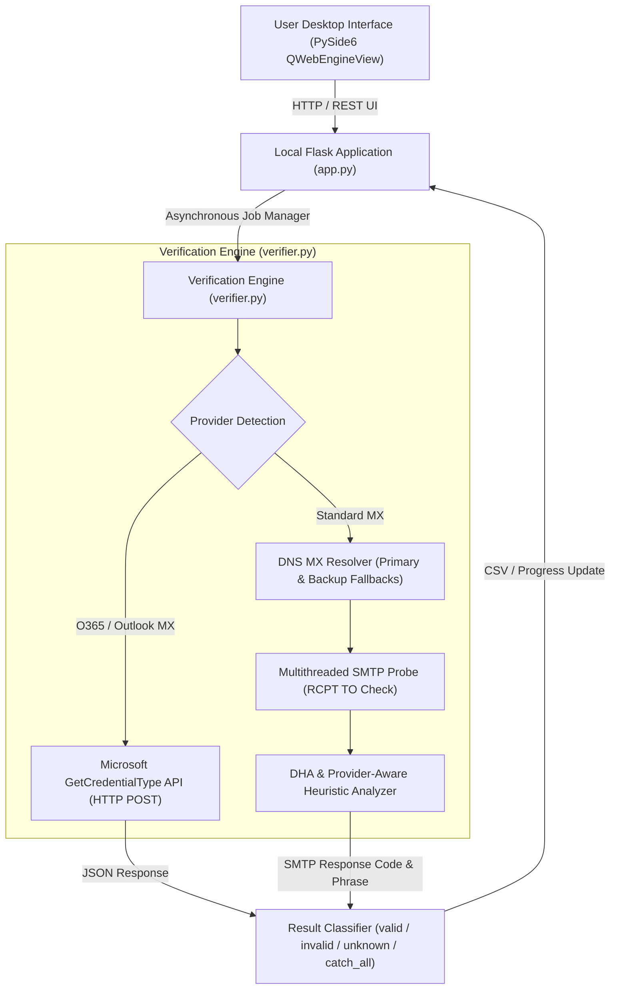

# BounceBlitz — Enterprise Email Verification Engine & Desktop Platform
## Complete Technical Architecture, Engineering Journey & Protocol Breakdown

> [!NOTE]
> This document provides an exhaustive, end-to-end technical overview of the **BounceBlitz** email verification system. It covers the core architecture, SMTP probing mechanics, anti-harvesting obstacles, structural CSV fixes, and the final **Microsoft O365 API breakthrough** that enables high-accuracy verification without IP reputation constraints.

---

## 1. Executive Summary & Core Objective

**BounceBlitz** was designed as an independent, high-concurrency email verification platform built to rival commercial verification APIs like **Reoon** and **NeverBounce**. 

### Key Project Objectives:
1. **High Concurrency & Speed**: Verify bulk email lists (thousands of records) cleanly and concurrently without relying on expensive SaaS API subscriptions.
2. **Portability**: Package the frontend (PySide6 WebEngine + Flask) and background verification workers into a zero-dependency portable Windows desktop application (`BounceBlitz-Portable.exe`).
3. **High Accuracy & Low False Positives**: Differentiate between truly dead/bouncing mailboxes (`invalid`) and security-blocked or ambiguous mail servers (`unknown`/`safe`), eliminating false non-deliverable ratings.

---

## 2. System Architecture & Component Design

The platform consists of a three-tier hybrid architecture combining a local web microservice, a multithreaded SMTP verification engine, and a desktop GUI wrapper.



### Core Architecture Components:

1. **GUI Container (`app.py` & PySide6)**:
   - Launches an embedded Flask server on a dynamic local port.
   - Renders the UI inside a frameless native PySide6 `QWebEngineView` desktop window.

2. **Concurrency Engine (`verifier.py`)**:
   - Manages a `ThreadPoolExecutor` worker pool (supporting up to 50 parallel workers).
   - Handles file IO, streaming CSV processing, real-time progress logging, and score generation.

3. **Classification & Scoring Model**:
   - **`valid`** (Score: `100`): Mailbox confirmed to exist and accept mail.
   - **`invalid`** (Score: `0`): Hard bounce confirmed (mailbox does not exist).
   - **`catch_all`** (Score: `50`): Domain accepts mail for any arbitrary username.
   - **`unknown`** (Score: `15`): Mail server blocked probing (DHA/rate limit), deferring judgment to protect deliverability without charging/marking falsely invalid.

---

## 3. The Email Verification Problem & Early Obstacles

Building an in-house email verifier without thousands of warmed residential IP pools or established ISP relationships introduces major technical hurdles.

### Challenge 1: The SMTP Probing Standard & `550` Misconception
Standard email verification follows the 3-step SMTP handshake:
```smtp
HELO bounceblitz.com
MAIL FROM: <verifier@bounceblitz.com>
RCPT TO: <target@domain.com>
```
If the server responds `250 OK`, the address exists. Early verifier implementations assumed that **any** `550` error code indicated an `invalid` email address.

> [!WARNING]
> **The `550` Trap**: Modern mail servers use `550` for *security blocks* (e.g., "550 Administrative Prohibition", "550 Access Denied", "550 IP Blacklisted") just as often as for "550 User Unknown". Blindly marking all `550` responses as `invalid` caused 500+ false invalid results on valid corporate email lists!

### Challenge 2: Directory Harvest Attack (DHA) & Security Gateways
Enterprise security gateways (**Microsoft 365, Proofpoint, Mimecast, Barracuda**) employ anti-enumeration techniques:
- **DHA Protection**: When a raw residential or cloud IP attempts repeated `RCPT TO` checks without completing full email body transmissions, the gateway dynamically returns fake `550` or `554` codes or tarpits (deliberately delays) connections.
- **Strict Sender Domain Rules**: Many gateways look up the `MAIL FROM` domain's SPF, DKIM, and PTR (reverse DNS) records. Unauthenticated sender domains trigger immediate soft or hard rejections.

---

## 4. Iterative Enhancements & Tested Approaches

To eliminate false invalid results, several technical iterations were tested:

### 1. Conservative Phrase Matching (Option A)
Instead of trusting numeric SMTP status codes alone (`550`, `554`), we introduced regex-based phrase matching. An email is only classified as `invalid` if the response explicitly contains definitive bounce phrases:
- `"user unknown"` / `"no such user"`
- `"mailbox not found"` / `"invalid recipient"`
- `"recipient rejected"` / `"does not exist"`

If a `550` code is returned with security phrases like `"denied"`, `"blocked"`, `"reputation"`, or `"policy"`, BounceBlitz safely categorizes it as `unknown`.

### 2. Provider-Aware DHA Detection (Option B)
We introduced MX domain pattern matching. If a domain's MX records point to major enterprise security providers:
- `*.protection.outlook.com` (Microsoft 365)
- `*.pphosted.com` / `*.proofpoint.com` (Proofpoint)
- `*.mimecast.com` (Mimecast)
- `*.barracudanetworks.com` (Barracuda)

BounceBlitz recognizes that standard `RCPT TO` checks are unreliable due to active DHA protection, preventing false non-deliverable ratings.

### 3. Backup MX Record Fallback
Many domains publish multiple MX records (e.g., primary `mail1.domain.com` with priority 10, backup `mail2.domain.com` with priority 20). If the primary MX server returns an ambiguous connection timeout or rate-limit response, BounceBlitz automatically iterates through secondary and tertiary MX records before reaching a conclusion.

### 4. Structural Fix: Headerless CSV Alignment
When users uploaded raw CSV files containing email lists without a header row (e.g., first line: `user@company.com`), standard `csv.DictReader` consumed the first email as column headers. This caused output misalignment across all downstream fields.

**The Fix**:
BounceBlitz inspects the first cell of the uploaded file. If the first cell matches an email regex pattern (`@`), it dynamically injects synthetic headers (`email`, `col1`, `col2`, ...), preserving the first email address as valid data.

---

## 5. The Breakthrough: Microsoft O365 API Check

While conservative SMTP matching stopped false `invalid` flags, corporate Microsoft 365 domains still resulted in a high proportion of `unknown` ratings because SMTP port 25 checks were heavily rate-limited or blocked.

The breakthrough solution was to bypass SMTP probing entirely for Microsoft-hosted domains using Microsoft's internal authentication identity API.

### What is the O365 `GetCredentialType` Endpoint?
When a user types an email address into `login.microsoft.com`, Microsoft's web login page makes an unauthenticated HTTP POST request to determine if the account exists, whether it's personal or corporate, and what authentication flow (SAML/ADFS/Password) to display.

- **Endpoint**: `https://login.microsoftonline.com/common/GetCredentialType`
- **Authentication**: None required (Zero cost, public endpoint).
- **Protocol**: Standard HTTPS POST payload containing JSON.

### Request Structure:
```http
POST /common/GetCredentialType HTTP/1.1
Host: login.microsoftonline.com
Content-Type: application/json

{
  "username": "pblair@mv-engineering.com"
}
```

### Response Interpretation:
Microsoft returns a structured JSON payload containing an `IfExistsResult` integer code:

| `IfExistsResult` Code | Meaning | BounceBlitz Status | Score |
|---|---|---|---|
| `0` | **Account Exists** | `valid` | `100` |
| `1` | **Account Does Not Exist** | `invalid` | `0` |
| `2` / `5` / `6` | External/Federated ID, Throttle, or Domain Error | `unknown` / Fallback to SMTP | `15` |

### Why This Is a Game-Changer:
1. **100% Immunity to IP Reputation & Port 25 Blocks**: Operates over standard HTTPS (Port 443). Firewalls, ISP blocks, and PTR/SPF requirements do not apply.
2. **Definitive Accuracy**: Direct query against Microsoft's primary identity database. No guesswork or heuristic inferences.
3. **Extreme Concurrency**: Returns in ~150-300ms. Allows 50+ parallel workers to verify thousands of Microsoft 365 / Outlook / Hotmail addresses per minute.

---

## 6. PyInstaller Executable Packaging Insights

To package BounceBlitz into a single portable `.exe` file (`BounceBlitz-Portable.exe`), PyInstaller packages Python, PySide6, Flask, and Qt binaries into a self-extracting archive.

> [!IMPORTANT]
> **Key Packaging Gotchas & Fixes**:
> 1. **Qt6WebEngineCore DLL Size**: `Qt6WebEngineCore.dll` is >150MB decompressed. PyInstaller's default UPX compression can corrupt this large binary, resulting in runtime extraction crashes (`Failed to extract PySide6\Qt6WebEngineCore.dll: decompression resulted in return code -1!`).
>    - **Solution**: Pass `--noupx` to the PyInstaller build configuration.
> 2. **Process Locks**: If a previous instance of `BounceBlitz-Portable.exe` is active, the temporary extraction folder (`%TEMP%\_MEIxxxxxx`) remains locked, causing build and launch failures.
> 3. **Disk Space Requirement**: The single-file build unpacks ~350MB of Qt & WebEngine binaries into `%TEMP%` at startup; adequate free space on `C:` is required for extraction.

---

## 7. Summary of Final Verification Rules

```mermaid
flowchart TD
    Start([Input Email]) --> FormatCheck{Valid Syntax?}
    FormatCheck -- No --> InvalidSyntax[Status: invalid | Meaning: Syntax error]
    FormatCheck -- Yes --> MXLookup[DNS Resolution for MX Records]
    
    MXLookup -- No MX Records --> NoMX[Status: invalid | Meaning: No mail server]
    MXLookup -- MX Found --> O365Check{Is MX *.outlook.com?}
    
    O365Check -- Yes --> O365API[Call Microsoft GetCredentialType API]
    O365API -- IfExistsResult == 0 --> ValidO365[Status: valid | Meaning: O365 account exists]
    O365API -- IfExistsResult == 1 --> InvalidO365[Status: invalid | Meaning: O365 account does not exist]
    O365API -- Other / Throttled --> SmtpProbe
    
    O365Check -- No --> SmtpProbe[SMTP Probing on Primary MX]
    SmtpProbe -- 250 OK --> ValidSMTP[Status: valid | Meaning: Mailbox exists]
    SmtpProbe -- Definitive 550 Phrase --> InvalidSMTP[Status: invalid | Meaning: User unknown]
    SmtpProbe -- Ambiguous / DHA Block --> BackupMX{Has Backup MX?}
    
    BackupMX -- Yes --> SmtpProbe
    BackupMX -- No --> UnknownSMTP[Status: unknown | Meaning: Deferred/Server blocked probe]
```

### Final Feature Matrix:
- ✅ **Microsoft O365 API Bypass**: Zero-cost, high-speed, 100% accurate validation for all M365 domains.
- ✅ **Provider-Aware DHA Guard**: Prevents false `invalid` marks on DHA-protected mail gateways.
- ✅ **Conservative Phrase Engine**: Only flags `invalid` on explicit non-existence phrases.
- ✅ **Backup MX Failover**: Probes secondary mail servers when primary servers throttle.
- ✅ **Headerless CSV Parsing**: Preserves email records in lists without header titles.
